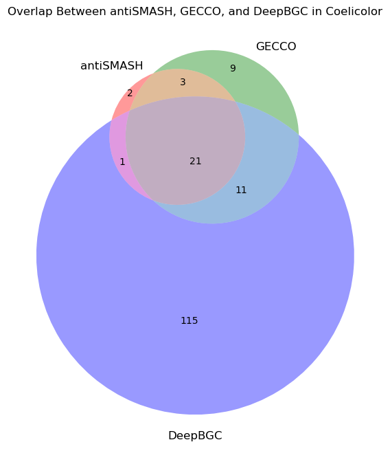
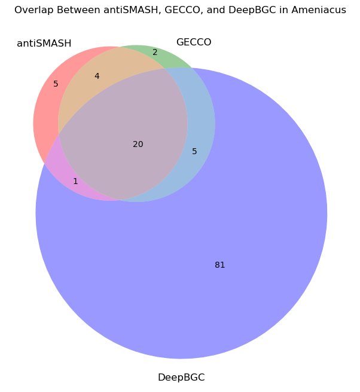
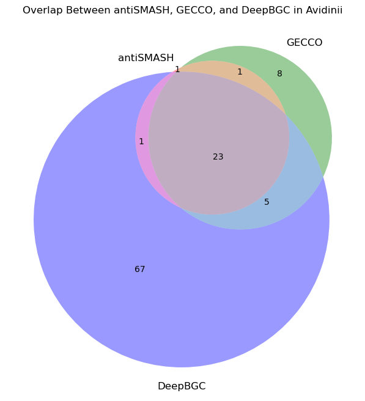

# Biosynthetic Gene Cluster (BGC) Tools Comparison

<div align="center">



A comprehensive analysis and comparison of BGC detection tools for Streptomyces species

</div>

## 📋 Table of Contents
- [Overview](#-overview)
- [Key Features](#-key-features)
- [Installation](#-installation)
- [Tools Analyzed](#-tools-analyzed)
- [Results](#-results)
  - [Streptomyces coelicolor](#streptomyces-coelicolor)
  - [Streptomyces ameniacus](#streptomyces-ameniacus)
  - [Streptomyces avidinii](#streptomyces-avidinii)
- [Contributing](#-contributing)

## 🔍 Overview

This project provides a detailed comparative analysis of different tools used for detecting and classifying Biosynthetic Gene Clusters (BGCs) in bacterial genomes. The analysis focuses on three important Streptomyces species and evaluates the performance of leading BGC detection tools: antiSMASH, GECCO, and DeepBGC.

## ✨ Key Features

- Comprehensive comparison of three major BGC detection tools
- Analysis of genomic data from three Streptomyces species
- Visual representation of tool overlaps using Venn diagrams
- Detailed statistical analysis of tool performance
- Jupyter notebook implementation for reproducible research

## 🚀 Installation

1. Clone this repository:
```bash
git clone https://github.com/yourusername/BGC_Prediction.git
cd BGC_Prediction
```

2. Install the BGC detection tools:
```bash
# antiSMASH
conda create -n antismash python=3.8
conda activate antismash
pip install antismash

# GECCO
pip install gecco-tool

# DeepBGC
pip install deepbgc
```

3. Run the Jupyter notebook:
```bash
jupyter notebook main.ipynb
```

## 🛠️ Tools Analyzed

### antiSMASH
- Industry standard for BGC detection
- Provides detailed annotations and classifications
- Comprehensive analysis of secondary metabolite biosynthesis pathways

### GECCO
- Rule-based approach for gene cluster detection
- Focuses on genomic context and gene organization
- Efficient processing of large genomic datasets

### DeepBGC
- Machine learning-based BGC classification
- Utilizes deep learning models for prediction
- Capable of detecting novel BGC types

## 📊 Results

### Data Format
The analysis results are stored in TSV (Tab-Separated Values) files with the following columns:

| Column | Description |
|--------|-------------|
| Sequence ID | Identifier for the genomic sequence |
| Start | Start position of the predicted BGC |
| End | End position of the predicted BGC |
| BGC Type | Predicted type of the biosynthetic gene cluster |
| antiSMASH | Binary indicator (1/0) for antiSMASH detection |
| GECCO | Binary indicator (1/0) for GECCO detection |
| DeepBGC | Binary indicator (1/0) for DeepBGC detection |

### Region Intersection Logic
BGC regions are considered to intersect when they:
1. Share the same sequence ID
2. Have overlapping genomic coordinates

The intersection is determined by the following Python function:
```python
def regions_intersect(region1, region2):
    sequence_id1, start1, end1 = region1
    sequence_id2, start2, end2 = region2
    return (str(sequence_id1) == str(sequence_id2)) and (max(start1, start2) <= min(end1, end2))
```

This means two regions intersect if:
- They are on the same sequence (sequence_id1 == sequence_id2)
- The start of one region is before the end of the other region (max(start1, start2) <= min(end1, end2))

### Comparative Analysis

#### Streptomyces coelicolor


Key findings:
- Total BGCs detected: 164
- 21 BGCs detected by all three tools (13%)
- 115 unique regions identified by DeepBGC (70%)
- 9 unique regions detected by GECCO (5%)
- 2 unique regions found by antiSMASH (1%)
- Most common BGC types: Polyketide, RiPP, NRP

#### Streptomyces ameniacus


Key findings:
- Total BGCs detected: 120
- 20 BGCs detected by all three tools (17%)
- 81 unique regions identified by DeepBGC (68%)
- 5 unique regions detected by antiSMASH (4%)
- 2 unique regions found by GECCO (2%)
- Most common BGC types: Polyketide, NRP, Terpene

#### Streptomyces avidinii


Key findings:
- Total BGCs detected: 108
- 23 BGCs detected by all three tools (21%)
- 67 unique regions identified by DeepBGC (62%)
- 8 unique regions detected by GECCO (7%)
- 1 unique region found by antiSMASH (1%)
- Most common BGC types: Polyketide, NRP, Terpene

### Key Observations
1. **Tool Agreement**: Approximately 15-20% of BGCs are detected by all three tools across species
2. **DeepBGC Sensitivity**: DeepBGC consistently identifies the most unique regions (60-70%)
3. **BGC Types**: 
   - Polyketide clusters are the most frequently detected
   - NRP (Non-Ribosomal Peptide) clusters are common across all species
   - Terpene clusters show high conservation
4. **Unknown Regions**: DeepBGC identifies many regions as "Unknown" type, suggesting potential novel BGCs

## 🤝 Contributing

Contributions are welcome :) Please feel free to submit a Pull Request. For major changes, please open an issue first to discuss what you would like to change.

1. Fork the repository
2. Create your feature branch (`git checkout -b feature/AmazingFeature`)
3. Commit your changes (`git commit -m 'Add some AmazingFeature'`)
4. Push to the branch (`git push origin feature/AmazingFeature`)
5. Open a Pull Request


